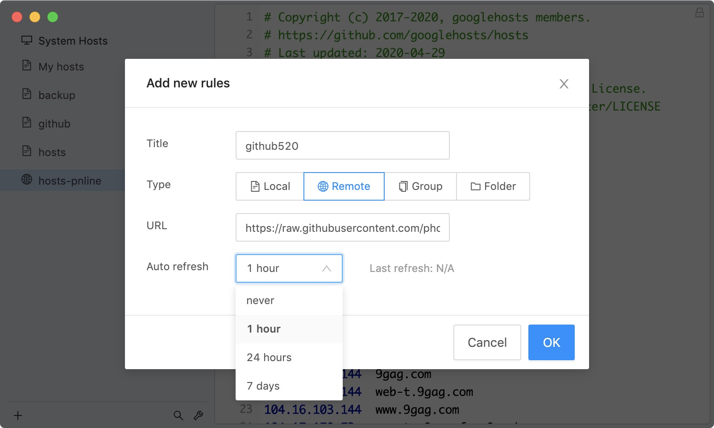

# GitHub520
<p align="center">
  
  <br><strong><a href="https://github.com/521xueweihan/HelloGitHub" target="_blank">HelloGitHub</a></strong> 分享 GitHub 上有趣、入门级的开源项目。<br>兴趣是最好的老师，这里能够帮你找到编程的兴趣！
</p>

## 一、介绍
对 GitHub 说"爱"太难了：访问慢、图片加载不出来。

*注：* 本项目还处于测试阶段，仅在本机测试通过，如有问题欢迎提 [issues](https://github.com/521xueweihan/GitHub520/issues/new)

---

本项目无需安装任何程序，通过修改本地 hosts 文件，试图解决：
- GitHub 访问速度慢的问题
- GitHub 项目中的图片显示不出的问题

花 5 分钟时间，让你"爱"上 GitHub。

## 二、使用方法

### 2.1 复制下面的内容
```bash
# GitHub520 Host Start
185.199.108.154               github.githubassets.com
199.232.68.133                camo.githubusercontent.com
199.232.68.133                github.map.fastly.net
199.232.69.194                github.global.ssl.fastly.net
140.82.112.3                  github.com
140.82.112.5                  api.github.com
199.232.68.133                raw.githubusercontent.com
199.232.68.133                user-images.githubusercontent.com
199.232.68.133                favicons.githubusercontent.com
199.232.68.133                avatars5.githubusercontent.com
199.232.68.133                avatars4.githubusercontent.com
199.232.68.133                avatars3.githubusercontent.com
199.232.68.133                avatars2.githubusercontent.com
199.232.68.133                avatars1.githubusercontent.com
199.232.68.133                avatars0.githubusercontent.com
# Star me GitHub url: https://github.com/521xueweihan/GitHub520
# GitHub520 Host End

```

上面内容会自动定时更新，保证最新有效。数据更新时间：2020-06-22T12:09:06+08:00（内容无变动不会更新）

### 2.1 手动方式
#### 2.1.1 修改 hosts 文件
hosts 文件在每个系统的位置不一，详情如下：
- Windows 系统：`C:\Windows\System32\drivers\etc\hosts`
- Linux 系统：`/etc/hosts`
- Mac（苹果电脑）系统：`/etc/hosts`
- Android（安卓）系统：`/system/etc/hosts`
- iPhone（iOS）系统：`/etc/hosts`

修改方法，把第一步的内容复制到文本末尾：

1. Windows 使用记事本。
2. Linux、Mac 使用 Root 权限：`sudo vi /etc/hosts`。
3. iPhone、iPad 须越狱、Android 必须要 root。

#### 2.1.2 激活生效
大部分情况下是直接生效，如未生效可尝试下面的办法，刷新 DNS：

1. Windows：在 CMD 窗口输入：`ipconfig /flushdns`

2. Linux 命令：`sudo rcnscd restart`

3. Mac 命令：`sudo killall -HUP mDNSResponder`

**Tips：** 上述方法无效可以尝试重启机器。

### 2.2 自动方式

**Tip**：推荐 [SwitchHosts](https://github.com/oldj/SwitchHosts) 工具管理 hosts

以 SwitchHosts 为例，看一下怎么使用的，配置参考下面：

- Title: 随意

- Type: `Remote`

- URL: `https://gitee.com/xueweihan/codes/6g793pm2k1hacwfbyesl464/raw?blob_name=GitHub520.yml`

- Auto Refresh: 最好选 `1 hour`

如图：



这样每次 hosts 有更新都能及时进行更新，免去手动更新。

## 三、效果对比
之前的样子：


修改完 hosts 的样子：


## TODO
- [x] 定时自动更新 hosts 内容
- [x] hosts 内容无变动不会更新
- [ ] 寻到最有 ip 解析结果


## 声明
<a rel="license" href="https://creativecommons.org/licenses/by-nc-nd/4.0/deed.zh"></a><br>本作品采用 <a rel="license" href="https://creativecommons.org/licenses/by-nc-nd/4.0/deed.zh">署名-非商业性使用-禁止演绎 4.0 国际</a> 进行许可。