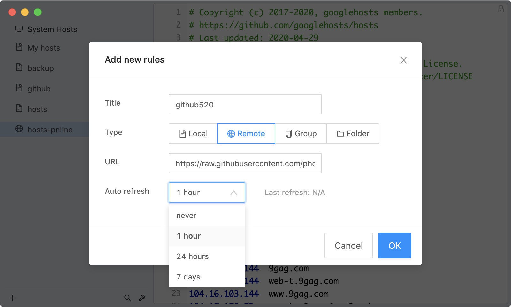
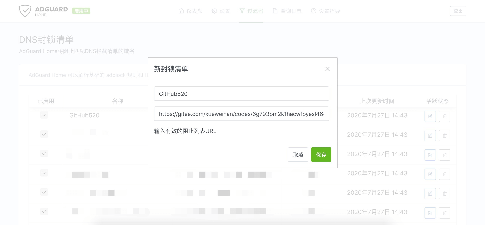
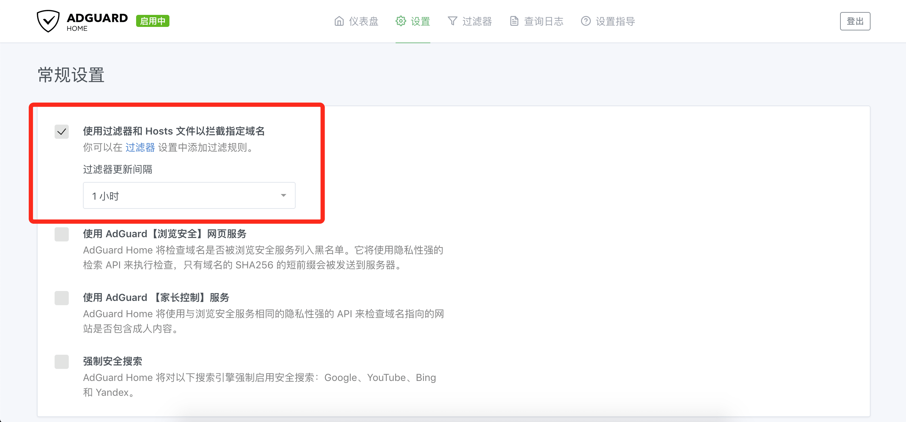

# GitHub520

<p align="center">
<a href="https://hellogithub.com/repository/d05ff820bf36470581c02cda5cbd17ea" target="_blank"></a><br>
😘 让你“爱”上 GitHub，解决访问时图裂、加载慢的问题。
</p>

> 服务器已续费到 2024.12 共花了：1500+💰 [点击扫码赞助](https://raw.hellogithub.com/code.png)，感谢🙏

## 一、介绍
对 GitHub 说"爱"太难了：访问慢、图片加载不出来。

**本项目无需安装任何程序，仅需 5 分钟。**

通过修改本地 hosts 文件，试图解决：
- GitHub 访问速度慢的问题
- GitHub 项目中的图片显示不出的问题

让你"爱"上 GitHub。


*注：* 本项目还处于测试阶段，仅在本机测试通过，如有问题欢迎提 [issues](https://github.com/521xueweihan/GitHub520/issues/new)


## 二、使用方法

下面的地址无需访问 GitHub 即可获取到最新的 hosts 内容：

- 文件：`https://raw.hellogithub.com/hosts`
- JSON：`https://raw.hellogithub.com/hosts.json`

### 2.1 手动方式

#### 2.1.1 复制下面的内容

```bash
{hosts_str}
```

该内容会自动定时更新， 数据更新时间：{update_time}

#### 2.1.2 修改 hosts 文件

hosts 文件在每个系统的位置不一，详情如下：
- Windows 系统：`C:\Windows\System32\drivers\etc\hosts`
- Linux 系统：`/etc/hosts`
- Mac（苹果电脑）系统：`/etc/hosts`
- Android（安卓）系统：`/system/etc/hosts`
- iPhone（iOS）系统：`/etc/hosts`

修改方法，把第一步的内容复制到文本末尾：

1. Windows 使用记事本。
2. Linux、Mac 使用 Root 权限：`sudo vi /etc/hosts`。
3. iPhone、iPad 须越狱、Android 必须要 root。

#### 2.1.3 激活生效
大部分情况下是直接生效，如未生效可尝试下面的办法，刷新 DNS：

1. Windows：在 CMD 窗口输入：`ipconfig /flushdns`

2. Linux 命令：`sudo nscd restart`，如报错则须安装：`sudo apt install nscd` 或 `sudo /etc/init.d/nscd restart`

3. Mac 命令：`sudo killall -HUP mDNSResponder`

**Tips：** 上述方法无效可以尝试重启机器。

### 2.2 自动方式（SwitchHosts）

**Tip**：推荐 [SwitchHosts](https://github.com/oldj/SwitchHosts) 工具管理 hosts

以 SwitchHosts 为例，看一下怎么使用的，配置参考下面：

- Hosts 类型: `Remote`

- Hosts 标题: 随意

- URL: `https://raw.hellogithub.com/hosts`

- 自动刷新: 最好选 `1 小时`

如图：



这样每次 hosts 有更新都能及时进行更新，免去手动更新。

### 2.3 一行命令

#### Windows

使用命令需要安装[git bash](https://gitforwindows.org/)
复制以下命令保存到本地命名为**fetch_github_hosts**

```shell
_hosts=$(mktemp /tmp/hostsXXX)
hosts=/c/Windows/System32/drivers/etc/hosts
remote=https://raw.hellogithub.com/hosts
reg='/# GitHub520 Host Start/,/# Github520 Host End/d'

sed "$reg" $hosts > "$_hosts"
curl "$remote" >> "$_hosts"
cat "$_hosts" > "$hosts"

rm "$_hosts"
```

在**CMD**中执行以下命令，执行前需要替换**git-bash.exe**和**fetch_github_hosts**为你本地的路径，注意前者为windows路径格式后者为shell路径格式

`"C:\Program Files\Git\git-bash.exe" -c "/c/Users/XXX/fetch_github_hosts"`

可以将上述命令添加到windows的task schedular（任务计划程序）中以定时执行

#### GNU（Ubuntu/CentOS/Fedora）

`sudo sh -c 'sed -i "/# GitHub520 Host Start/Q" /etc/hosts && curl https://raw.hellogithub.com/hosts >> /etc/hosts'`

#### BSD/macOS

`sudo sed -i "" "/# GitHub520 Host Start/,/# Github520 Host End/d" /etc/hosts && curl https://raw.hellogithub.com/hosts | sudo tee -a /etc/hosts`

将上面的命令添加到 cron，可定时执行。使用前确保 GitHub520 内容在该文件最后部分。

**在 Docker 中运行，若遇到 `Device or resource busy` 错误，可使用以下命令执行**

`cp /etc/hosts ~/hosts.new && sed -i "/# GitHub520 Host Start/Q" ~/hosts.new && curl https://raw.hellogithub.com/hosts >> ~/hosts.new && cp -f ~/hosts.new /etc/hosts`

### 2.4 AdGuard 用户（自动方式）

在 **过滤器>DNS 封锁清单>添加阻止列表>添加一个自定义列表**，配置如下：

- 名称：随意

- URL：`https://raw.hellogithub.com/hosts`（和上面 SwitchHosts 使用的一样）

如图：



更新间隔在 **设置 > 常规设置 > 过滤器更新间隔（设置一小时一次即可）**，记得勾选上 **使用过滤器和 Hosts 文件以拦截指定域名**



**Tip**：不要添加在 **DNS 允许清单** 内，只能添加在 **DNS 封锁清单** 才管用。 另外，AdGuard for Mac、AdGuard for Windows、AdGuard for Android、AdGuard for IOS 等等 **AdGuard 家族软件** 添加方法均类似。


## 三、效果对比
之前的样子：


修改完 hosts 的样子：


## TODO
- [x] 定时自动更新 hosts 内容
- [x] hosts 内容无变动不会更新
- [x] 寻到最优 IP 解析结果

## 声明
<a rel="license" href="https://creativecommons.org/licenses/by-nc-nd/4.0/deed.zh"></a><br>本作品采用 <a rel="license" href="https://creativecommons.org/licenses/by-nc-nd/4.0/deed.zh">署名-非商业性使用-禁止演绎 4.0 国际</a> 进行许可。
